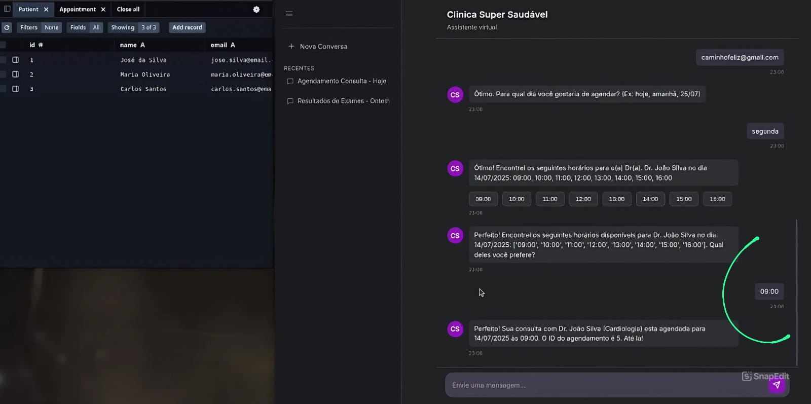
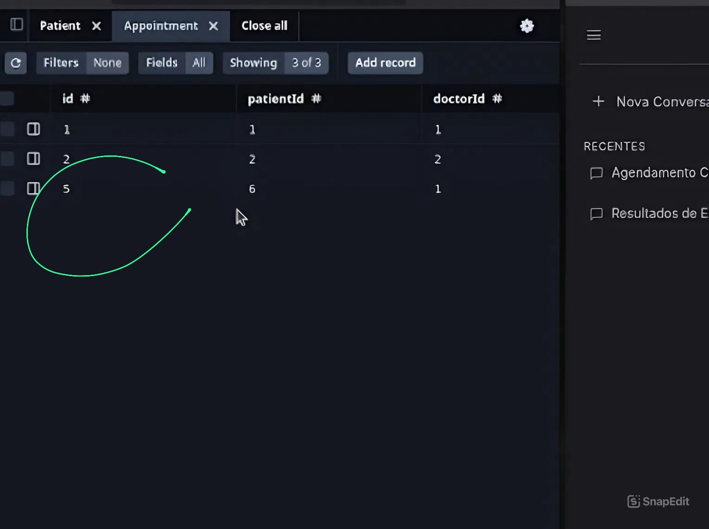
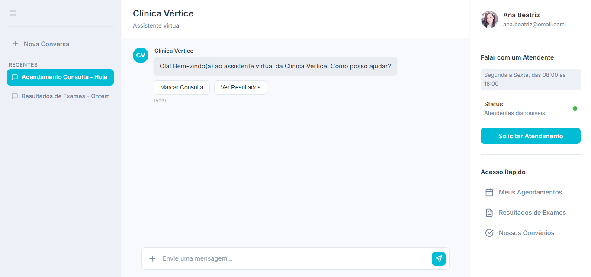

# Chatbot da Clinica Vértice

Este projeto apresenta um chatbot de atendimento para a Clínica Vértice, um nome que simboliza o ponto mais alto do tratamento e do bem-estar.

A versão inicial era capaz de realizar agendamentos, responder perguntas gerais sobre saúde e muito mais, graças à sua integração com um BD em tempo real e a API do Gemini.
A mais recente atualização expande a interação, trazendo uma interface mais humana, funcionalidades de atendimento direto e um design totalmente renovado, alinhado à identidade visual de uma clínica moderna e acolhedora.

---

## Features

  * **Integração Real com Banco de Dados (Prisma & Postgres):**

      * As especialidades, médicos e horários são consultados diretamente do banco de dados, garantindo informações sempre atualizadas;
      * Os agendamentos são **salvos em tempo real** no banco de dados ao final do fluxo.

      * O bot verifica a agenda do médico no banco de dados e mostra **apenas os horários realmente livres** para a data escolhida pelo usuário.

  * **Gemini:**

      * O chatbot consegue entender frases complexas e já preencher os dados do agendamento, tornando a conversa mais fluida;
      * Se o usuário fizer uma pergunta que não seja sobre agendamentos (ex: "o que é bom para dor de cabeça?"), o bot utiliza a IA do Gemini para fornecer uma resposta útil, mantendo o usuário engajado.

  * **Fluxo de Agendamento:**

      * O usuário é guiado desde a escolha da especialidade até a seleção do médico e do horário;
      * Coleta de dados do paciente (nome e email) e criação de um registro no BD, se necessário;
      * Confirmação final com todos os detalhes (médico, especialidade, data, hora) e o **ID do agendamento** salvo no banco.

   * **✨ Nova Interface e Funcionalidades de Atendimento (Última Atualização):**
   
     **Novo Nome e Identidade Visual:**
      
      * O projeto foi renomeado para Clínica Vértice.
      * O layout foi redesenhado com uma nova paleta de cores, transmitindo a seriedade e o acolhimento de uma clínica de saúde.
      
      **Status de Atendentes:**
      
      * A interface agora exibe o status em tempo real dos atendentes, informando ao usuário se há alguém disponível para atendimento imediato.
      
      **Perfil de Usuário e Atendimento Personalizado:**
      
      * Implementação de um perfil de usuário (ex: Ana Beatriz), humanizando a interação.
      * Exibição de horários específicos em que o usuário pode falar diretamente com a atendente.
      
      **Acesso Rápido e Solicitação de Atendimento:**
      
      * Um botão de "Solicitar Atendimento" permite ao usuário entrar na fila ou iniciar uma conversa direta de forma prática.
      * Menus de acesso rápido foram adicionados para guiar o usuário às principais funcionalidades sem depender apenas do chat.

---

## Run

```.env
GEMINI_API_KEY=
DATABASE_URL=
```

sudo apt update

sudo apt install python3.8 python3.8-venv

source ./venv/bin/activate

pip install rasa

pip install -r requirements.txt

rasa train

---

npm install

npx prisma migrate dev

npx prisma db seed

npm run build

- npm start

---

- rasa run actions
- npm run rasa:server

---

- npx prisma studio

deactivate

---

## Demo

  * Info


  * Conversa (em 3 prints)




  * Resultado no BD (Criação do Paciente +Consulta)



  * Banco e bot com horários atualizados (não mostra novamente o horário das 9h na segunda)


---

## Nova Interface da Clínica Vértice
  * Nova tela Principal e Layout
    

---
## Roadmap

  * Cancelar ou alterar seus agendamentos.
  * Permitir que o usuário veja suas consultas passadas e futuras.
